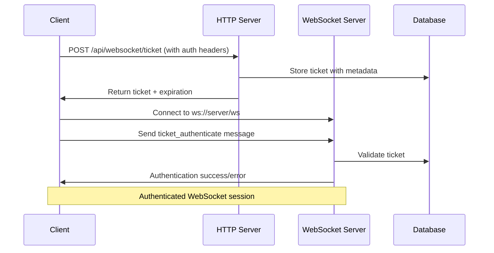

# WebSocket Ticket-Based Authentication API

## Authentication Flow



## API Endpoints

### 1. Request WebSocket Ticket

**Endpoint:** `POST /api/websocket/ticket`

**Headers:**
```http
Content-Type: application/json
Authorization: Bearer {userMpAuthToken}
X-Chat-Server-Key: {chatServerKey}
```

**Request Body:**
```json
{
  "userId": "user-123",
  "entityId": "brand-456",
  "entityType": "BRAND",
  "providerResId": "",
  "clientInfo": {
    "userAgent": "Mozilla/5.0...",
    "timestamp": "2024-01-15T10:30:00.000Z"
  }
}
```

**Response (Success):**
```json
{
  "success": true,
  "ticket": "ws_ticket_abc123def456...",
  "expiresAt": "2024-01-15T11:30:00.000Z"
}
```

**Response (Error):**
```json
{
  "success": false,
  "error": "Invalid authentication token",
  "code": "AUTH_INVALID"
}
```

### 2. WebSocket Authentication Message

**WebSocket URL:** `ws://your-server.com/ws` or `wss://your-server.com/ws`

**Authentication Message (sent immediately after connection):**
```json
{
  "type": "ticket_authenticate",
  "ticket": "ws_ticket_abc123def456...",
  "clientInfo": {
    "userAgent": "Mozilla/5.0...",
    "timestamp": "2024-01-15T10:30:00.000Z"
  }
}
```

**Server Response (Success):**
```json
{
  "type": "authentication_success",
  "sessionId": "session_xyz789",
  "user": {
    "userId": "user-123",
    "entityId": "brand-456",
    "entityType": "BRAND"
  }
}
```

**Server Response (Error):**
```json
{
  "type": "authentication_error",
  "error": "Invalid or expired ticket",
  "code": "TICKET_INVALID"
}
```

## Error Codes

| Code | Description | HTTP Status |
|------|-------------|-------------|
| `AUTH_INVALID` | Invalid authentication token | 401 |
| `AUTH_MISSING` | Missing authentication header | 401 |
| `SERVER_KEY_INVALID` | Invalid chat server key | 401 |
| `USER_NOT_FOUND` | User not found | 404 |
| `RATE_LIMITED` | Too many ticket requests | 429 |
| `TICKET_INVALID` | Invalid ticket | 401 |
| `TICKET_EXPIRED` | Ticket has expired | 401 |
| `TICKET_USED` | Ticket already used | 401 |

