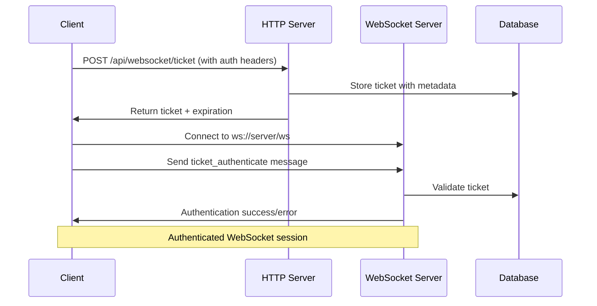

# WebSocket Ticket-Based Authentication API

## Overview

This document describes the **ticket-based authentication system** for WebSocket connections. This approach provides enhanced security by separating the authentication process from the WebSocket connection itself.

## Authentication Flow



## API Endpoints

### 1. Request WebSocket Ticket

**Endpoint:** `POST /api/websocket/ticket`

**Headers:**
```http
Content-Type: application/json
Authorization: Bearer {userMpAuthToken}
X-Chat-Server-Key: {chatServerKey}
```

**Request Body:**
```json
{
  "userId": "user-123",
  "entityId": "brand-456",
  "entityType": "BRAND",
  "providerResId": "",
  "clientInfo": {
    "userAgent": "Mozilla/5.0...",
    "timestamp": "2024-01-15T10:30:00.000Z"
  }
}
```

**Response (Success):**
```json
{
  "success": true,
  "ticket": "ws_ticket_abc123def456...",
  "expiresAt": "2024-01-15T11:30:00.000Z"
}
```

**Response (Error):**
```json
{
  "success": false,
  "error": "Invalid authentication token",
  "code": "AUTH_INVALID"
}
```

### 2. WebSocket Authentication Message

**WebSocket URL:** `ws://your-server.com/ws` or `wss://your-server.com/ws`

**Authentication Message (sent immediately after connection):**
```json
{
  "type": "ticket_authenticate",
  "ticket": "ws_ticket_abc123def456...",
  "clientInfo": {
    "userAgent": "Mozilla/5.0...",
    "timestamp": "2024-01-15T10:30:00.000Z"
  }
}
```

**Server Response (Success):**
```json
{
  "type": "authentication_success",
  "sessionId": "session_xyz789",
  "user": {
    "userId": "user-123",
    "entityId": "brand-456",
    "entityType": "BRAND"
  }
}
```

**Server Response (Error):**
```json
{
  "type": "authentication_error",
  "error": "Invalid or expired ticket",
  "code": "TICKET_INVALID"
}
```

## Server Implementation Requirements

### 1. Ticket Generation (HTTP Endpoint)

```typescript
interface TicketData {
  id: string;                    // Unique ticket ID
  userId: string;               // User identification
  entityId?: string;            // Brand/Account ID
  entityType?: string;          // BRAND, ACCOUNT, USER
  providerResId?: string;       // Provider resource ID
  chatServerKey: string;        // Server identification
  clientIP: string;             // Client IP address
  userAgent: string;            // Client user agent
  createdAt: Date;              // Creation timestamp
  expiresAt: Date;              // Expiration timestamp (recommend 1-2 hours)
  used: boolean;                // Whether ticket has been used
}
```

**Recommended Implementation:**
1. Validate `Authorization` header and `X-Chat-Server-Key`
2. Generate cryptographically secure ticket (e.g., 64+ character random string)
3. Store ticket in database/cache (Redis recommended for expiration)
4. Set expiration time (recommend 1-2 hours)
5. Return ticket and expiration to client

### 2. WebSocket Authentication

**When client sends `ticket_authenticate` message:**
1. Extract ticket from message
2. Look up ticket in database/cache
3. Validate:
   - Ticket exists
   - Not expired
   - Not already used (optional: single-use tickets)
   - Client IP matches (optional: for extra security)
4. Mark ticket as used (if single-use)
5. Store user session data
6. Send authentication response

### 3. Upstash Redis Storage

```typescript
// Ticket data structure stored in Upstash Redis
interface TicketRedisData {
  id: string;                    // Ticket ID
  userId: string;               // User identification
  entityId?: string;            // Brand/Account ID
  entityType?: string;          // BRAND, ACCOUNT, USER
  providerResId?: string;       // Provider resource ID
  chatServerKey: string;        // Server identification
  clientIP: string;             // Client IP address
  userAgent: string;            // Client user agent
  createdAt: string;            // Creation timestamp (ISO string)
  expiresAt: string;            // Expiration timestamp (ISO string)
  used: boolean;                // Whether ticket has been used
}

// Redis key pattern: "ticket:{ticketId}"
// TTL: Automatically handled by Redis (1-2 hours)
```

## Security Considerations

### 1. Ticket Security
- **Unique & Cryptographically Secure**: Use crypto.randomBytes() or equivalent
- **Limited Lifetime**: 1-2 hour expiration maximum
- **Single Use**: Consider making tickets single-use
- **IP Validation**: Optionally validate client IP matches

### 2. Storage Security
- **Secure Storage**: Use Upstash Redis with automatic TTL expiration
- **Cleanup**: Automatically handled by Redis TTL (no manual cleanup needed)
- **Rate Limiting**: Limit ticket requests per user/IP

### 3. Error Handling
- **Generic Errors**: Don't expose internal details
- **Logging**: Log authentication attempts for monitoring
- **Monitoring**: Alert on unusual patterns

## Error Codes

| Code | Description | HTTP Status |
|------|-------------|-------------|
| `AUTH_INVALID` | Invalid authentication token | 401 |
| `AUTH_MISSING` | Missing authentication header | 401 |
| `SERVER_KEY_INVALID` | Invalid chat server key | 401 |
| `USER_NOT_FOUND` | User not found | 404 |
| `RATE_LIMITED` | Too many ticket requests | 429 |
| `TICKET_INVALID` | Invalid ticket | 401 |
| `TICKET_EXPIRED` | Ticket has expired | 401 |
| `TICKET_USED` | Ticket already used | 401 |

## Example Server Implementation (Node.js)

### Upstash Redis Setup
```javascript
// Using @upstash/redis
import { Redis } from '@upstash/redis';

const redis = new Redis({
  url: process.env.UPSTASH_REDIS_REST_URL,
  token: process.env.UPSTASH_REDIS_REST_TOKEN,
});
```

### Ticket Generation
```javascript
app.post('/api/websocket/ticket', authenticateUser, async (req, res) => {
  try {
    const { userId, entityId, entityType, providerResId, clientInfo } = req.body;
    const chatServerKey = req.headers['x-chat-server-key'];
    
    // Generate secure ticket
    const ticket = 'ws_ticket_' + crypto.randomBytes(32).toString('hex');
    const expiresAt = new Date(Date.now() + 2 * 60 * 60 * 1000); // 2 hours
    
    // Store in Upstash Redis with TTL
    await redis.setex(`ticket:${ticket}`, 7200, JSON.stringify({
      id: ticket,
      userId,
      entityId,
      entityType,
      providerResId,
      chatServerKey,
      clientIP: req.ip,
      userAgent: clientInfo?.userAgent || req.get('User-Agent'),
      createdAt: new Date().toISOString(),
      expiresAt: expiresAt.toISOString(),
      used: false
    }));
    
    res.json({
      success: true,
      ticket,
      expiresAt: expiresAt.toISOString()
    });
  } catch (error) {
    res.status(500).json({
      success: false,
      error: 'Failed to generate ticket'
    });
  }
});
```

### WebSocket Authentication
```javascript
ws.on('message', async (message) => {
  const data = JSON.parse(message);
  
  if (data.type === 'ticket_authenticate') {
    try {
      // Validate ticket from Upstash Redis
      const ticketData = await redis.get(`ticket:${data.ticket}`);
      if (!ticketData) {
        ws.send(JSON.stringify({
          type: 'authentication_error',
          error: 'Invalid or expired ticket',
          code: 'TICKET_INVALID'
        }));
        return;
      }
      
      const ticket = JSON.parse(ticketData);
      
      // Check if ticket was already used (optional: single-use)
      if (ticket.used) {
        ws.send(JSON.stringify({
          type: 'authentication_error',
          error: 'Ticket already used',
          code: 'TICKET_USED'
        }));
        return;
      }
      
      // Mark as used and delete from Upstash Redis (single-use)
      await redis.del(`ticket:${data.ticket}`);
      
      // Store session data
      ws.userId = ticket.userId;
      ws.entityId = ticket.entityId;
      ws.entityType = ticket.entityType;
      ws.chatServerKey = ticket.chatServerKey;
      ws.authenticated = true;
      
      ws.send(JSON.stringify({
        type: 'authentication_success',
        sessionId: generateSessionId(),
        user: {
          userId: ticket.userId,
          entityId: ticket.entityId,
          entityType: ticket.entityType
        },
        timestamp: new Date().toISOString()
      }));
    } catch (error) {
      ws.send(JSON.stringify({
        type: 'authentication_error',
        error: 'Authentication failed',
        code: 'AUTH_ERROR'
      }));
    }
  }
});
```

## Testing

### Manual Testing
```bash
# 1. Request ticket
curl -X POST https://your-server.com/api/websocket/ticket \
  -H "Authorization: Bearer your-token" \
  -H "X-Chat-Server-Key: your-key" \
  -H "Content-Type: application/json" \
  -d '{"userId":"test-user","entityId":"test-brand","entityType":"BRAND"}'

# 2. Connect WebSocket and send authentication
# (Use WebSocket client to send ticket_authenticate message)
```

This ticket-based system provides robust security while maintaining simplicity for both client and server implementation.